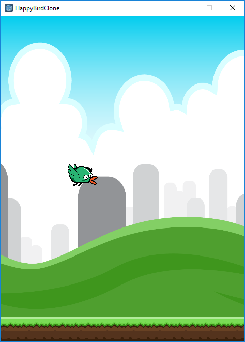
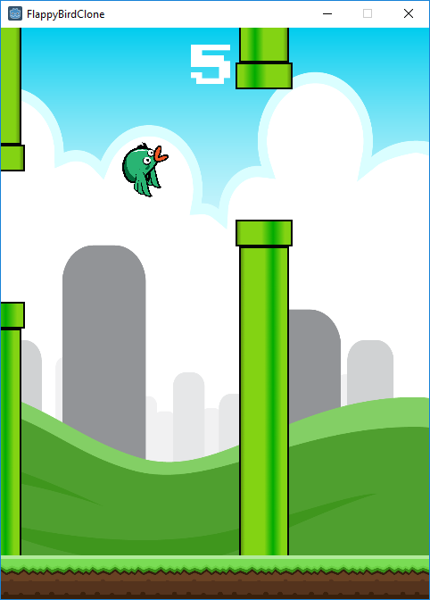
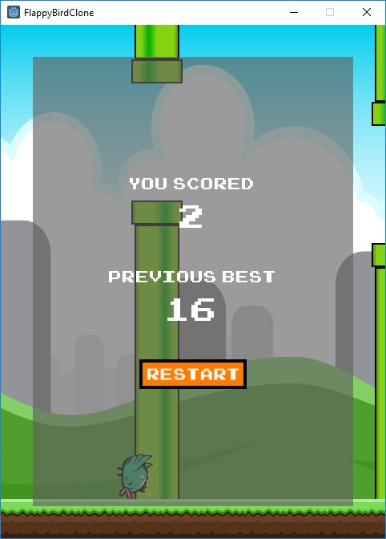

# FlappyBirdClone

Into the deep end with game development!  In an effort to get properly started with game dev and to stop making excuses, I've decided to make clones of some common and fairly popular games and game genres.  For the 2D portion, I have decided to work with the Godot engine as it seems to be a very friendly environment, open source, free, and fun to use.  This is the second game I've made on the engine, and this time I've decided to make a Flappy Bird clone.

## Game Clone Series
1. [Breakout](https://github.com/kazeraniman/BreakoutClone)
2. [**Flappy Bird**](https://github.com/kazeraniman/FlappyBirdClone)
3. [Falling Tetrominos](https://github.com/kazeraniman/FallingTetrominosClone)

## Learning Objectives

This time I decided to put a bit more cleanliness into the game and to try to emulate the original a bit more.  Since the original game is quite simple, this was a good opportunity to match the majority of the functionality.  This time around I got more of a taste of making a better UI, in particular when creating the menu which would show up on game over.  I also got a good taste of the use of animation in the engine, both through animated sprites, and in general animating different properties.  As the bird's model changes, the hit-box changes in step as well by moulding to the sprite quite closely to prevent any feeling of "I didn't hit that".  I originally felt like this would be a good chance to try out the physics engine and allow it to take over for the bird's flight but as I wanted control over rotation and a number of other small details, the physics were hindering me more than they were helping me so I ditched it and worked on custom physics (maybe I'll give the RigidBody physics a shot when I make a bullet hell game).  This did however give me insight into the fact that I should be splitting up the timestep and not doing physics calculations in the rendering step so that was a good fix over the last game.  A similar experience was had when adding in the parallax background.  There's in-built support for it but adding a camera to a game with no real motion seemed like overkill, and so the animation came into play again to roll my own parallax effect.  A last noteworthy point is some primitive saving was experimented with.  This save is completely hackable and has nothing even remotely secure about it (anyone can alter their previous best to whatever they want), but as it isn't a multiplayer game, if people want to do that, that's their perogative.  I'll be looking more into using some level of encryption and cheat-protection however in a future game with an actual, proper leaderboard.  For now however, that'll do pig, that'll do.

## Result

Just like in the original, the starting phase is just a pleasant calm where the bird flies along without a care in the world, until the player starts up the game.

Once the first flight request is sent in, the player has a couple seconds to get used to the feel of the game before the obstacles start coming.  Truth be told, I haven't made it too far in the original flappy bird (and this version is significantly easier) so I don't know if the pipe generation changes eventually, but here it's kept constant and randomly places the opening in the available space.  Each time you fly though the opening, you score a point.

When you inevitable hit the wall, the poor bird goes into freefall and flaps his wings helplessly as the menu fades into view.  The score this round and the previous best are displayed, along with an option to replay to try to beat the last score.  The button is really for show and for visual clarity; mashing out the fly button in frustration will get you back into the game.  There is however a slight delay applied to avoid the issue of accidentally passing over the menu.  This would be a bigger deal for leaderboards, but still seemed like a good addition.

## Controls

Clicking or pressing the spacebar will cause the bird to fly upward.  The game does not start until you first start to fly.  On game over, either the button may be clicked or either of the flight keys may be pressed to restart.

## Resource Attribution

All resources which were not my creations are attributed in [attribution.md](attribution.md).
